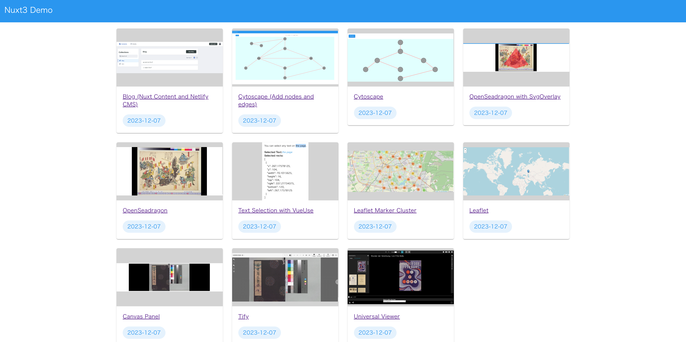

# Nuxt 3 Demo

Sample Repository for Nuxt3 Including Examples of Various Library Usages



## 🌐 Website

[Visit the demo page](https://nakamura196.github.io/nuxt3-demo/) to try it out.

## Setup

Make sure to install the dependencies:

```bash
# yarn
yarn install

# npm
npm install

# pnpm
pnpm install --shamefully-hoist
```

## Development Server

Start the development server on http://localhost:3000

```bash
npm run dev
```

## Production

Build the application for production:

```bash
npm run build
```

Locally preview production build:

```bash
npm run preview
```

Check out the [deployment documentation](https://nuxt.com/docs/getting-started/deployment) for more information.
